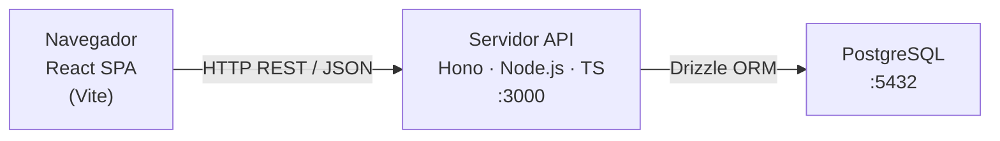
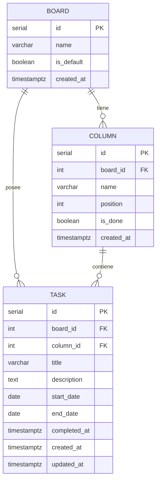

# Taskboard — Arquitectura

## Stack

| Área | Tecnología | Por qué |
|------|-----------|---------|
| Framework frontend | Vite + React + TypeScript | SPA (sin SSR para app personal); mayor ecosistema para DnD y tablas |
| Estilos | Tailwind CSS + shadcn/ui | Utilidades primero; primitivos sin estilo — control total sin partir de cero |
| Arrastrar y soltar | @dnd-kit | Diseñado específicamente para Kanban; accesible y performante |
| Tabla ordenable | TanStack Table | Sin cabeza (headless); gestiona ordenación y filtros sin marcado impuesto |
| Gráficas | Recharts | Gráficas React ligeras; suficiente para un dashboard de métricas |
| Framework backend | Hono + Node.js + TypeScript | Superficie mínima, TypeScript nativo, rápido — sin el overhead de NestJS a esta escala |
| ORM | Drizzle | Esquema TypeScript-first; migraciones como código; sin magia |
| Base de datos | PostgreSQL | Relacional, fiable, soporte JSON, listo para producción desde el primer día |
| Runtime | Node.js 20+ | LTS; ESM nativo; alineado con las recomendaciones de Hono y Drizzle |

---

## Visión general del sistema



Monolito de un solo nivel. El frontend es una build estática servida por cualquier CDN
o por el mismo proceso Node. Sin colas, sin caché, sin microservicios — innecesario a
esta escala.

---

## Componentes

### Frontend

| Componente | Responsabilidad |
|------------|----------------|
| `ListPage` | Renderiza la tabla TanStack con todas las tareas; gestiona el sort por encabezado de columna |
| `BoardPage` | Renderiza un tablero; columnas + tarjetas; orquesta el contexto @dnd-kit |
| `DashboardPage` | Obtiene `/api/dashboard` y renderiza los widgets Recharts |
| `TaskModal` | Formulario de creación/edición; validación; llama a POST o PATCH |
| `BoardColumn` | Zona de destino (drop target); renderiza las tarjetas en su interior |
| `TaskCard` | Fuente de arrastre (drag source); muestra título y estado rápido |
| `api/` | Wrappers de fetch por recurso — sin librería HTTP externa |

### Backend

| Módulo | Responsabilidad |
|--------|----------------|
| `routes/boards.ts` | CRUD de tableros |
| `routes/columns.ts` | CRUD + reordenación de columnas |
| `routes/tasks.ts` | CRUD + endpoint de movimiento |
| `routes/dashboard.ts` | Consultas de agregación para métricas |
| `db/schema.ts` | Definiciones de tablas Drizzle |
| `db/seed.ts` | Crea el tablero por defecto + 4 columnas en el primer arranque |

---

## Modelo de datos



### Esquema Drizzle (`backend/src/db/schema.ts`)

```typescript
import {
  pgTable, serial, varchar, text,
  boolean, integer, date, timestamp,
} from 'drizzle-orm/pg-core';

export const boards = pgTable('boards', {
  id:        serial('id').primaryKey(),
  name:      varchar('name', { length: 255 }).notNull(),
  isDefault: boolean('is_default').notNull().default(false),
  createdAt: timestamp('created_at', { withTimezone: true }).notNull().defaultNow(),
});

export const columns = pgTable('columns', {
  id:        serial('id').primaryKey(),
  boardId:   integer('board_id').notNull().references(() => boards.id, { onDelete: 'cascade' }),
  name:      varchar('name', { length: 255 }).notNull(),
  position:  integer('position').notNull(),
  isDone:    boolean('is_done').notNull().default(false),
  createdAt: timestamp('created_at', { withTimezone: true }).notNull().defaultNow(),
});

export const tasks = pgTable('tasks', {
  id:          serial('id').primaryKey(),
  boardId:     integer('board_id').notNull().references(() => boards.id, { onDelete: 'cascade' }),
  columnId:    integer('column_id').notNull().references(() => columns.id, { onDelete: 'restrict' }),
  title:       varchar('title', { length: 500 }).notNull(),
  description: text('description').notNull(),
  startDate:   date('start_date'),
  endDate:     date('end_date'),
  completedAt: timestamp('completed_at', { withTimezone: true }),
  createdAt:   timestamp('created_at', { withTimezone: true }).notNull().defaultNow(),
  updatedAt:   timestamp('updated_at', { withTimezone: true }).notNull().defaultNow(),
});
```

### Índices

```sql
-- Consultas por tablero (vista lista, US-01)
CREATE INDEX idx_tasks_board_id ON tasks(board_id);

-- Contenido de columna (vista tablero, US-05)
CREATE INDEX idx_tasks_column_id ON tasks(column_id);

-- Dashboard: tareas completadas por fecha (US-09)
CREATE INDEX idx_tasks_completed_at ON tasks(completed_at)
  WHERE completed_at IS NOT NULL;

-- Dashboard: tareas vencidas (US-09)
CREATE INDEX idx_tasks_end_date ON tasks(end_date)
  WHERE end_date IS NOT NULL;

-- Orden de columnas dentro de un tablero (US-05, US-13)
CREATE INDEX idx_columns_board_position ON columns(board_id, position);
```

---

## Contrato de API

Todos los endpoints tienen el prefijo `/api`. Las respuestas son JSON. Los errores siguen
el formato `{ error: string, details?: unknown }`.

### Tableros

| Método | Ruta | US | Descripción |
|--------|------|----|-------------|
| `GET` | `/boards` | US-02, US-07 | Lista todos los tableros (id, name, is_default) |
| `POST` | `/boards` | US-07 | Crea tablero; auto-crea las 4 columnas por defecto |
| `PATCH` | `/boards/:id` | US-10 | Renombra tablero |
| `DELETE` | `/boards/:id` | US-11 | Elimina tablero (requiere param `reassign_to` o `delete_tasks`) |

### Columnas

| Método | Ruta | US | Descripción |
|--------|------|----|-------------|
| `GET` | `/boards/:boardId/columns` | US-05 | Columnas de un tablero, ordenadas por posición |
| `POST` | `/boards/:boardId/columns` | US-08 | Añade columna al tablero |
| `PATCH` | `/columns/:id` | US-12 | Renombra columna o cambia is_done |
| `PATCH` | `/boards/:boardId/columns/reorder` | US-13 | Reordena: `{ order: number[] }` (array de ids) |
| `DELETE` | `/columns/:id` | US-16 | Elimina columna; requiere que esté vacía o reasignada |

### Tareas

| Método | Ruta | US | Descripción |
|--------|------|----|-------------|
| `GET` | `/tasks` | US-01 | Todas las tareas; params: `sort`, `order` (asc/desc) |
| `POST` | `/tasks` | US-02 | Crea tarea |
| `GET` | `/tasks/:id` | US-03 | Tarea individual |
| `PATCH` | `/tasks/:id` | US-03 | Actualiza campos de la tarea |
| `DELETE` | `/tasks/:id` | US-04 | Elimina tarea |
| `PATCH` | `/tasks/:id/move` | US-06 | Mueve a columna: `{ columnId: number }` |

**GET /tasks** campos ordenables: `title`, `description`, `start_date`, `end_date`,
`created_at`, `board_name`, `column_name`.

**PATCH /tasks/:id/move** efecto secundario: si la columna destino tiene `is_done = true`,
establece `completed_at = now()`; si la columna origen tenía `is_done = true`, limpia `completed_at`.

### Dashboard

| Método | Ruta | US | Descripción |
|--------|------|----|-------------|
| `GET` | `/dashboard` | US-09 | Payload de métricas |

**GET /dashboard** respuesta:
```json
{
  "byStatus": [{ "columnName": "Pendiente", "count": 5 }, ...],
  "completedLast7Days": 3,
  "completedLast30Days": 12,
  "unplanned": 4,
  "overdue": 2
}
```

---

## Aspectos transversales

### Gestión de errores
Middleware de Hono captura errores no gestionados y devuelve `500` con mensaje genérico.
Los errores de validación (campos requeridos ausentes) devuelven `400` con detalle por campo.

### Logging
`console` para el prototipo. Logging estructurado (pino) a añadir si se pasa a producción.

### CORS
Middleware CORS de Hono permite `http://localhost:5173` (dev Vite) en desarrollo;
origen de producción bloqueado mediante variable de entorno `ALLOWED_ORIGIN`.

### Configuración
`dotenv` en desarrollo; variables de entorno en producción. Variables requeridas:
`DATABASE_URL`, `PORT` (por defecto 3000), `ALLOWED_ORIGIN`.

### Autenticación
Ninguna en v1. Si se añade más adelante: el middleware de Hono es el lugar correcto;
recomendado: Lucia o Supabase Auth (ver ADR-005).

---

## Estructura del repositorio

```
taskboard/
├── frontend/
│   ├── src/
│   │   ├── api/              # wrappers de fetch por recurso
│   │   ├── components/
│   │   │   ├── ui/           # primitivos shadcn/ui
│   │   │   ├── board/        # BoardColumn, TaskCard, BoardView
│   │   │   ├── task/         # TaskModal, TaskForm
│   │   │   └── dashboard/    # MetricCard, StatusChart
│   │   ├── pages/
│   │   │   ├── ListPage.tsx
│   │   │   ├── BoardPage.tsx
│   │   │   └── DashboardPage.tsx
│   │   ├── hooks/            # useTasks, useBoards, useDashboard
│   │   ├── types/            # tipos TS compartidos (Task, Board, Column)
│   │   └── main.tsx
│   ├── package.json
│   └── vite.config.ts
├── backend/
│   ├── src/
│   │   ├── db/
│   │   │   ├── schema.ts
│   │   │   ├── seed.ts
│   │   │   └── index.ts      # cliente Drizzle
│   │   ├── routes/
│   │   │   ├── boards.ts
│   │   │   ├── columns.ts
│   │   │   ├── tasks.ts
│   │   │   └── dashboard.ts
│   │   ├── services/         # lógica de negocio (mover tarea, seed, consultas métricas)
│   │   └── index.ts          # app Hono + middleware
│   ├── drizzle.config.ts
│   └── package.json
├── docs/
├── PROJECT_STATE.md
└── README.md
```

---

## Registros de decisiones de arquitectura (ADR)

### ADR-001: TypeScript en toda la pila

**Contexto:** Sin restricción tecnológica; el usuario quiere un código moderno y mantenible.
**Decisión:** TypeScript en frontend (Vite/React) y backend (Hono/Node).
**Consecuencias:** Un solo lenguaje reduce el cambio de contexto; los tipos pueden duplicarse
o compartirse mediante un módulo `types/`. Añade un paso de compilación al backend, pero las
herramientas (tsx, tsup) lo hacen casi transparente.

---

### ADR-002: PostgreSQL desde el primer día (sin fase SQLite)

**Contexto:** El usuario quiere backend desde el primer día y el proyecto tiene una ruta clara
hacia producción.
**Decisión:** PostgreSQL como único objetivo de base de datos; sin paso intermedio por SQLite.
**Consecuencias:** Requiere una instancia de Postgres en desarrollo local (Docker compose o
una instancia gestionada gratuita como Neon). Sin riesgo de migración futura. Ligera fricción
de configuración local comparado con SQLite.

---

### ADR-003: Vite SPA frente a Next.js

**Contexto:** Web app, uso personal, sin requisitos de SEO, sin páginas renderizadas en servidor.
**Decisión:** Vite + React SPA. La API es un servidor Hono separado.
**Consecuencias:** Separación limpia entre frontend y backend; modelo mental más simple;
sin complejidad "use client" / "use server" de Next.js. Contrapartida: dos procesos en
desarrollo (Vite dev server + servidor Hono); resuelto con un único `npm run dev` en la raíz
mediante `concurrently`.

---

### ADR-004: Hono frente a Express o NestJS

**Contexto:** Se necesita un framework HTTP Node.js con TypeScript.
**Decisión:** Hono. Ligero (~14 kB), TypeScript nativo, validación incorporada, funciona
igual en Node y runtimes edge.
**Consecuencias:** Comunidad más pequeña que Express, pero mantenido activamente y bien
documentado. NestJS rechazado: demasiada ceremonia (decoradores, módulos, DI) para una
app de este tamaño. Express rechazado: sin tipos TS nativos, sin validación incorporada.

---

### ADR-005: Flag `is_done` en columnas para seguimiento de completado

**Contexto:** US-09 requiere rastrear "tareas completadas en los últimos 7/30 días". El
completado debe definirse sin depender de que la columna se llame "Done" / "Finalizada"
(frágil; se rompe si el usuario renombra la columna).
**Decisión:** `columns.is_done: boolean`. La columna "Finalizada" por defecto se inicializa
con `is_done = true`. Cuando una tarea se mueve a una columna `is_done`, el backend
establece `tasks.completed_at = now()`. Moverla fuera lo limpia.
**Consecuencias:** El usuario puede renombrar las columnas de completado libremente. El flag
`is_done` debe ser editable (PATCH /columns/:id). Tener solo una columna `is_done` por
tablero es una convención suave, no una restricción de base de datos, para el prototipo.
