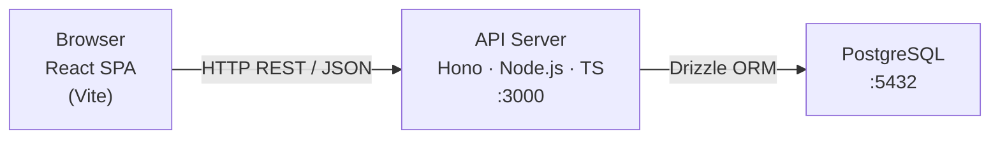
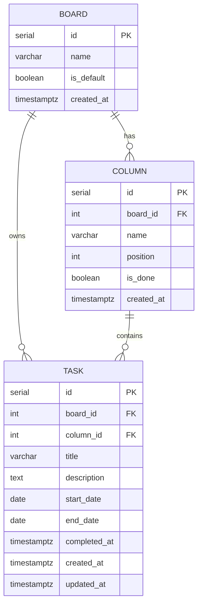

# Taskboard — Architecture

## Stack

| Area | Choice | Reason |
|------|--------|--------|
| Frontend framework | Vite + React + TypeScript | SPA (no SSR needed for personal app); largest DnD/table ecosystem |
| Styling | Tailwind CSS + shadcn/ui | Utility-first, unstyled primitives — full control without starting from zero |
| Drag & drop | @dnd-kit | Purpose-built for Kanban; accessible, performant, no jQuery legacy |
| Sortable table | TanStack Table | Headless; handles sorting, filtering without opinionated markup |
| Charts | Recharts | Lightweight React-native charts; enough for a metrics dashboard |
| Backend framework | Hono + Node.js + TypeScript | Minimal surface area, first-class TS, fast — no NestJS overhead for this scale |
| ORM | Drizzle | TypeScript-first schema; migrations as code; zero magic |
| Database | PostgreSQL | Relational, reliable, JSON support, production-grade from day one |
| Runtime | Node.js 20+ | LTS; native ESM; aligns with Hono and Drizzle recommendations |

---

## System overview



Single-tier monolith. Frontend is a static build served by any CDN or the same Node process.
No queue, no cache, no microservices — all unnecessary at this scale.

---

## Components

### Frontend

| Component | Responsibility |
|-----------|---------------|
| `ListPage` | Renders TanStack Table with all tasks; handles column-header sort |
| `BoardPage` | Renders a single board; columns + task cards; orchestrates @dnd-kit context |
| `DashboardPage` | Fetches `/api/dashboard` and renders Recharts widgets |
| `TaskModal` | Create / edit form; validation; calls POST or PATCH |
| `BoardColumn` | Drop target; renders task cards inside |
| `TaskCard` | Drag source; displays title + quick status |
| `api/` | Thin fetch wrappers per resource — no external HTTP library needed |

### Backend

| Module | Responsibility |
|--------|---------------|
| `routes/boards.ts` | CRUD for boards |
| `routes/columns.ts` | CRUD + reorder for columns |
| `routes/tasks.ts` | CRUD + move endpoint |
| `routes/dashboard.ts` | Aggregation queries for metrics |
| `db/schema.ts` | Drizzle table definitions |
| `db/seed.ts` | Creates the default board + 4 columns on first run |

---

## Data model



### Drizzle schema (`backend/src/db/schema.ts`)

```typescript
import {
  pgTable, serial, varchar, text,
  boolean, integer, date, timestamp,
} from 'drizzle-orm/pg-core';

export const boards = pgTable('boards', {
  id:        serial('id').primaryKey(),
  name:      varchar('name', { length: 255 }).notNull(),
  isDefault: boolean('is_default').notNull().default(false),
  createdAt: timestamp('created_at', { withTimezone: true }).notNull().defaultNow(),
});

export const columns = pgTable('columns', {
  id:        serial('id').primaryKey(),
  boardId:   integer('board_id').notNull().references(() => boards.id, { onDelete: 'cascade' }),
  name:      varchar('name', { length: 255 }).notNull(),
  position:  integer('position').notNull(),
  isDone:    boolean('is_done').notNull().default(false),
  createdAt: timestamp('created_at', { withTimezone: true }).notNull().defaultNow(),
});

export const tasks = pgTable('tasks', {
  id:          serial('id').primaryKey(),
  boardId:     integer('board_id').notNull().references(() => boards.id, { onDelete: 'cascade' }),
  columnId:    integer('column_id').notNull().references(() => columns.id, { onDelete: 'restrict' }),
  title:       varchar('title', { length: 500 }).notNull(),
  description: text('description').notNull(),
  startDate:   date('start_date'),
  endDate:     date('end_date'),
  completedAt: timestamp('completed_at', { withTimezone: true }),
  createdAt:   timestamp('created_at', { withTimezone: true }).notNull().defaultNow(),
  updatedAt:   timestamp('updated_at', { withTimezone: true }).notNull().defaultNow(),
});
```

### Indexes

```sql
-- board membership queries (list page board filter, US-01)
CREATE INDEX idx_tasks_board_id ON tasks(board_id);

-- column content queries (board view, US-05)
CREATE INDEX idx_tasks_column_id ON tasks(column_id);

-- dashboard: completed tasks by date (US-09)
CREATE INDEX idx_tasks_completed_at ON tasks(completed_at)
  WHERE completed_at IS NOT NULL;

-- dashboard: overdue tasks (US-09)
CREATE INDEX idx_tasks_end_date ON tasks(end_date)
  WHERE end_date IS NOT NULL;

-- column ordering within board (US-05, US-13)
CREATE INDEX idx_columns_board_position ON columns(board_id, position);
```

---

## API contract

All endpoints are prefixed `/api`. Responses are JSON. Errors follow
`{ error: string, details?: unknown }`.

### Boards

| Method | Path | US | Description |
|--------|------|----|-------------|
| `GET` | `/boards` | US-02, US-07 | List all boards (id, name, is_default) |
| `POST` | `/boards` | US-07 | Create board; auto-creates 4 default columns |
| `PATCH` | `/boards/:id` | US-10 | Rename board |
| `DELETE` | `/boards/:id` | US-11 | Delete board (requires `reassign_to` or `delete_tasks` param) |

**POST /boards** request: `{ name: string }`
**POST /boards** response: `{ id, name, is_default, columns: [...] }`

### Columns

| Method | Path | US | Description |
|--------|------|----|-------------|
| `GET` | `/boards/:boardId/columns` | US-05 | Columns for a board, ordered by position |
| `POST` | `/boards/:boardId/columns` | US-08 | Add column to board |
| `PATCH` | `/columns/:id` | US-12 | Rename column or toggle is_done |
| `PATCH` | `/boards/:boardId/columns/reorder` | US-13 | Reorder: `{ order: number[] }` (array of column ids) |
| `DELETE` | `/columns/:id` | US-16 | Delete column; requires tasks to be empty or reassigned |

### Tasks

| Method | Path | US | Description |
|--------|------|----|-------------|
| `GET` | `/tasks` | US-01 | All tasks; query params: `sort`, `order` (asc/desc) |
| `POST` | `/tasks` | US-02 | Create task |
| `GET` | `/tasks/:id` | US-03 | Single task |
| `PATCH` | `/tasks/:id` | US-03 | Update task fields |
| `DELETE` | `/tasks/:id` | US-04 | Delete task |
| `PATCH` | `/tasks/:id/move` | US-06 | Move to column: `{ columnId: number }` |

**GET /tasks** sortable fields: `title`, `description`, `start_date`, `end_date`,
`created_at`, `board_name`, `column_name`.

**POST /tasks** request:
```json
{
  "boardId": 1,
  "columnId": 2,
  "title": "string (required)",
  "description": "string (required)",
  "startDate": "2026-06-13 (optional)",
  "endDate": "2026-06-30 (optional)"
}
```

**PATCH /tasks/:id/move** side-effect: if target column has `is_done = true`,
sets `completed_at = now()`; if source column had `is_done = true`, clears `completed_at`.

### Dashboard

| Method | Path | US | Description |
|--------|------|----|-------------|
| `GET` | `/dashboard` | US-09 | Metrics payload |

**GET /dashboard** response:
```json
{
  "byStatus": [{ "columnName": "Pending", "count": 5 }, ...],
  "completedLast7Days": 3,
  "completedLast30Days": 12,
  "unplanned": 4,
  "overdue": 2
}
```

---

## Cross-cutting concerns

### Error handling
Hono middleware catches unhandled errors and returns `500` with a generic message.
Validation errors (missing required fields) return `400` with field-level detail.

### Logging
`console` for the prototype. Structured logging (pino) to add if moving to production.

### CORS
Hono CORS middleware allows `http://localhost:5173` (Vite dev) in development;
production origin locked via `ALLOWED_ORIGIN` env var.

### Configuration
`dotenv` in development; env vars in production. Required vars:
`DATABASE_URL`, `PORT` (default 3000), `ALLOWED_ORIGIN`.

### Auth
None for v1. If added later: Hono middleware slot is already the right place;
recommended: Lucia or Supabase Auth (see ADR-005).

---

## Repo structure

```
taskboard/
├── frontend/
│   ├── src/
│   │   ├── api/              # fetch wrappers per resource
│   │   ├── components/
│   │   │   ├── ui/           # shadcn/ui primitives
│   │   │   ├── board/        # BoardColumn, TaskCard, BoardView
│   │   │   ├── task/         # TaskModal, TaskForm
│   │   │   └── dashboard/    # MetricCard, StatusChart
│   │   ├── pages/
│   │   │   ├── ListPage.tsx
│   │   │   ├── BoardPage.tsx
│   │   │   └── DashboardPage.tsx
│   │   ├── hooks/            # useTasks, useBoards, useDashboard
│   │   ├── types/            # shared TS types (Task, Board, Column)
│   │   └── main.tsx
│   ├── package.json
│   └── vite.config.ts
├── backend/
│   ├── src/
│   │   ├── db/
│   │   │   ├── schema.ts
│   │   │   ├── seed.ts
│   │   │   └── index.ts      # Drizzle client
│   │   ├── routes/
│   │   │   ├── boards.ts
│   │   │   ├── columns.ts
│   │   │   ├── tasks.ts
│   │   │   └── dashboard.ts
│   │   ├── services/         # business logic (move task, seed board, metrics queries)
│   │   └── index.ts          # Hono app + middleware
│   ├── drizzle.config.ts
│   └── package.json
├── docs/
├── PROJECT_STATE.md
└── README.md
```

---

## Architecture Decision Records

### ADR-001: TypeScript across the full stack

**Context:** No technology constraint; user wants a modern, maintainable codebase.
**Decision:** TypeScript on both frontend (Vite/React) and backend (Hono/Node).
**Consequences:** Single language reduces context switching; types can be duplicated or
shared via a `types/` module. Adds a build step to the backend but tooling (tsx, tsup)
makes this near-transparent.

---

### ADR-002: PostgreSQL from day one (no SQLite prototype phase)

**Context:** User explicitly wants backend from day one and the project has a clear
production path.
**Decision:** PostgreSQL as the only database target; no SQLite intermediate step.
**Consequences:** Requires a running Postgres instance for local development (Docker
compose or a free managed instance like Neon). Drizzle supports Postgres natively.
No future migration risk. Slightly more local setup friction vs SQLite.

---

### ADR-003: Vite SPA over Next.js

**Context:** Web app, personal use, no SEO requirements, no server-rendered pages needed.
**Decision:** Vite + React SPA. The API is a separate Hono server.
**Consequences:** Clean separation of frontend and backend; simpler mental model; no
Next.js "use client" / "use server" complexity. Trade-off: two processes in development
(Vite dev server + Hono server); solved with a single `npm run dev` at the root via
`concurrently`.

---

### ADR-004: Hono over Express or NestJS

**Context:** Need a Node.js HTTP framework with TypeScript.
**Decision:** Hono. Lightweight (~14 kB), first-class TypeScript, built-in validation,
works identically on Node and edge runtimes.
**Consequences:** Smaller community than Express but actively maintained and
well-documented. NestJS rejected: too much ceremony (decorators, modules, DI) for an
app of this size. Express rejected: no native TS types, no built-in validation.

---

### ADR-005: `is_done` flag on columns for completion tracking

**Context:** US-09 requires tracking "tasks completed in the last 7/30 days". Completion
must be defined without relying on a column being named "Done" / "Finalizada" (brittle;
breaks if user renames the column).
**Decision:** `columns.is_done: boolean`. The default "Done"/"Finalizada" column is
seeded with `is_done = true`. When a task is moved to an `is_done` column, the backend
sets `tasks.completed_at = now()`. Moving it out clears it.
**Consequences:** The user can rename completion columns freely. The `is_done` flag must
be editable (PATCH /columns/:id). Only one `is_done` column per board is a soft
convention, not a DB constraint, for the prototype.
